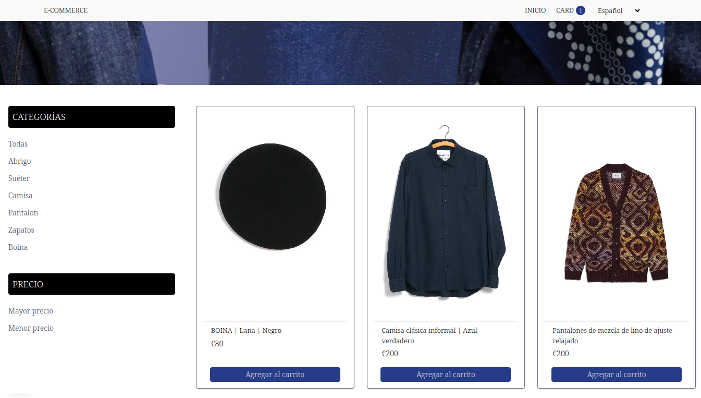

# 🛒 My E-commerce Store

E-commerce desarrollado con **Next.js**, **TypeScript**, **TailwindCSS** y manejo de carrito usando `useReducer`.

---

## 🚀 Tecnologías utilizadas

- [Next.js](https://nextjs.org/) – Framework React para SSR y rutas automáticas.
- [React](https://reactjs.org/) – Librería principal para la UI.
- [TypeScript](https://www.typescriptlang.org/) – Tipado estático para mayor seguridad.
- [Tailwind CSS](https://tailwindcss.com/) – Utilidades CSS modernas y personalizables.
- `useReducer` – Lógica global del carrito de compras.
- **Soporte de traducción** – Textos dinámicos en Español/Inglés.
- **Audios en botones** – Feedback sonoro para la interacción del usuario.
- **Datos propios cargados manualmente** – Productos personalizados sin depender de APIs externas.

---

## 📸 Vista previa



---

## 📦 Funcionalidades

- 🛍 Listado de productos cargados manualmente.
- 🌎 Soporte **multi-idioma**: Español e Inglés.
- 🔊 **Sonidos en botones** para mejorar la experiencia de usuario.
- 🔎 Filtro por categoría.
- 📊 Orden por precio (mayor y menor).
- 🛒 Carrito de compras:
  - Agregar y eliminar productos.
  - Mostrar cantidad de unidades.
  - Calcular precio total.
  - Modificar cantidad desde el carrito.
- ✅ Confirmación de compra con mensaje temporal.
- 📱 Interfaz 100% responsive y moderna.

---

## 🛠️ Instalación

1. Cloná el repositorio:

```bash
git clone https://github.com/Nicolas-Eliazer-Jara/-E-commerce
cd -E-commerce


2. Instalá las dependencias:

```bash
npm install

3. Iniciá el servidor de desarrollo:

```bash
npm run dev

## 📁 Estructura del proyecto


app
│   ├── cart
│   ├── components
│   ├── [id]
│   ├── product
│   ├── reducers
│   ├── store
│   ├── styles
│   └── types

## 🎨 Temas personalizados

En globals.css se configuraron 4 colores principales para usar fácilmente con Tailwind:

--color-primary:     #D7D261;
--color-secondary:   #292623;
--color-tertiary:    #DFDAC8;
--color-quaternary:  #0C5FB3;

Ejemplo de uso:

<div className="bg-primary text-secondary">Producto</div>

## 🙌 Autor

Hecho con 💻 por Nicolás Eliazer Jara – 2025